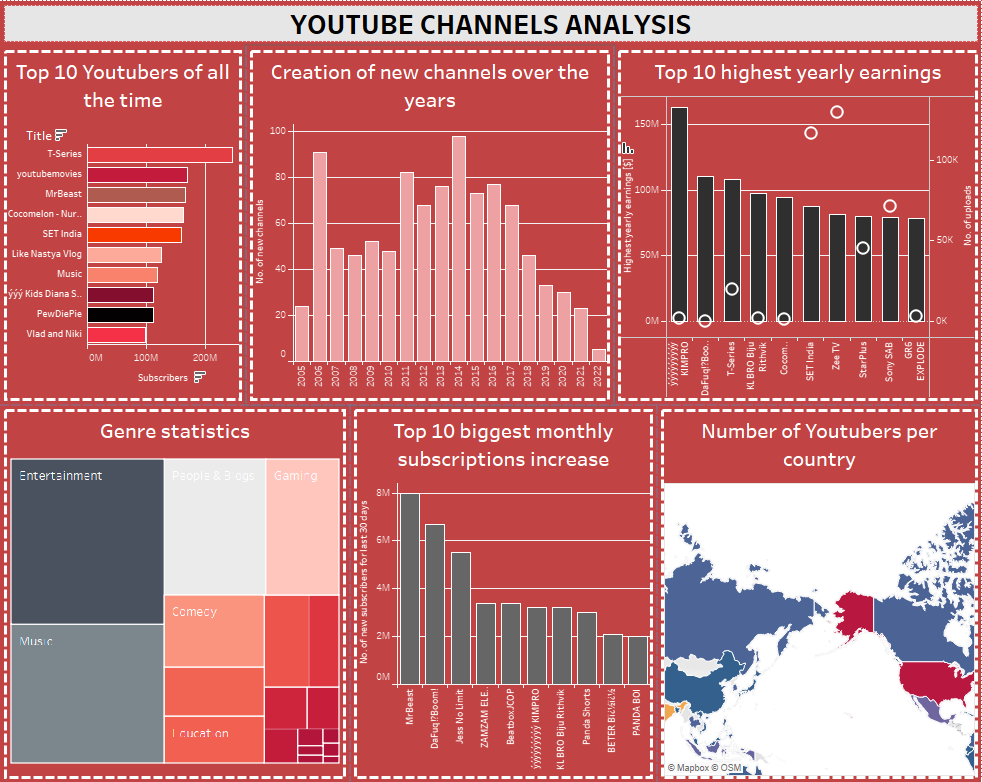

# YouTube Channels Analysis

### Project Overview
---
This project provides insights into global YouTube statistics.

 The dashboard brings statistical information about YT channels in an easy on the eye form. With its use, we can identify which YouTubers dominate when it comes to subscriptions and as well as annual earnings. In addition, the cartogram included visualizes which countries are the largest sources of the channels. Furthermore, we are able to highlight the most popular genre of uploaded videos.

The dashboard was made using the Tableau tool.

A preview of the dashboard below:

>

### Data Sources

The primary dataset used for the analysis was downloaded from [kaggle.com](https://www.kaggle.com/datasets/nelgiriyewithana/global-youtube-statistics-2023/data).
